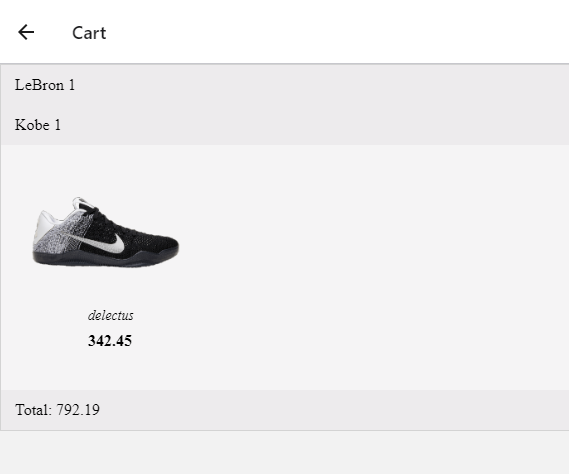

## Running the App

To run the app, clone the repo and at the root level, run npm start. That will start the expo server.

You should see a browser tab like this open up. To run on Android device, make sure you have an AVD (Android Virtual Device) running already before clicking `Run on Android device/emulator`.

To run on iOS, I would assume that you need to run xcode first, and then click on the `Run on iOS simulator`. I have a windows machine, so I used my iPhone to test it out. To do that, change the connection tab from `LAN` to `Tunnel`. You must also have the Expo client app on your iPhone. Then open up the Camera app and scan the QR code to open the app.

Click on `Run in Web Browser` to open a port in the web.

There's a bug (Android specific) where if you go into the cart in Android and then expand one of the items, there will be an error complaining about `cannot add children to yoganode`. I Googled it and there doesn't seem to be a solid solution for it, and it works fine on web (last screenshot). I didn't try spending more time to fix it.

## Sample Screens

### Cart as seen on a web browser

## Tests

I wrote some unit tests using `Jest` and `Enzyme` to test my custom `Item` component and `BasketballScreen`. The other screens are very similar to `BasketballScreen`, so I didn't write any unit tests for those, but if this app were to go to release, then those screens would need unit tests.

As components become more stable/polished, snapshot tests might be valuable, but as components are still in development iteration, snapshot tests will break constantly, so it doesn't provide that much value initially.

I used `native-base` UI library for the buttons, accordion, image, icon etc. It should not be this app's responsibility to test those components, as the `native-base` library should be handling that.
